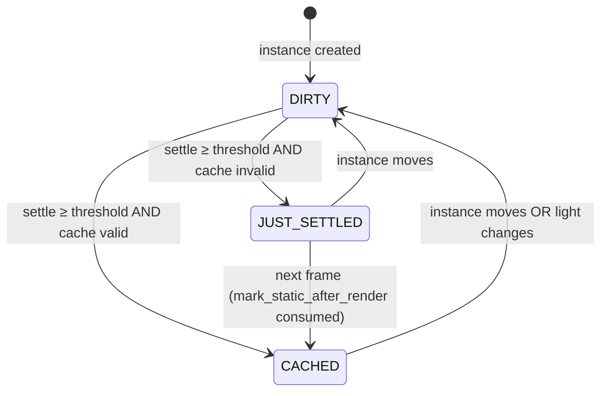

# RT Infrastructure: Acceleration Structures & Shadow Caching

**Branch:** `unreal` | **Date:** February 2026
**Status:** Infrastructure complete, demo running

---

## Table of Contents

1. [What We Were Trying to Accomplish](#1-what-we-were-trying-to-accomplish)
2. [What Was Built](#2-what-was-built)
3. [Reading the Demo HUD](#3-reading-the-demo-hud)
4. [How It Works: BLAS & TLAS](#4-how-it-works-blas--tlas)
5. [How It Works: Shadow Caching](#5-how-it-works-shadow-caching)
6. [What Comes Next](#6-what-comes-next)

---

## 1. What We Were Trying to Accomplish

### The Gap

Godot 4.7's Vulkan backend (`rendering_device_driver_vulkan.cpp`, lines 6098–6493) contains a
**complete, production-quality hardware ray tracing API**:

- `blas_create()` / `tlas_create()` — allocate GPU acceleration structures
- `tlas_instances_buffer_fill()` — populate the scene hierarchy
- `acceleration_structure_build()` — trigger GPU BVH construction
- `trace_rays()` / `ShaderRD::setup_raytracing()` — dispatch RT shaders

**None of these functions are ever called.**

The rendering pipeline is 100% rasterization-only. RTX and RDNA2+ GPUs expose full hardware RT
capability that Godot completely ignores. The gap analysis in
[`GRAPHICS_ENHANCEMENT_ANALYSIS.md`](GRAPHICS_ENHANCEMENT_ANALYSIS.md) identified this as
the **highest ROI opportunity in the entire codebase**: the hardest part (the Vulkan driver work)
is already done.

### Shadow Cost

Beyond the RT gap, shadow rendering has a secondary problem: Godot re-renders **all** shadow
casters every frame for every shadow-casting light — even if every object in the scene has been
completely still for seconds. For a scene with 7 lights and 37 meshes, this is up to
7 × 37 = 259 unnecessary shadow render passes per frame when nothing is moving.

### What This Work Addresses

This branch implements **Phase A** of the RT roadmap: building the infrastructure that future
RT rendering effects (reflections, AO, GI, shadows) will rely on. It also adds an independent
shadow caching optimization that reduces shadow render passes for static geometry immediately,
without waiting for the full RT pipeline.

---

## 2. What Was Built

Two independent features were implemented:

```
Feature A                          Feature B
━━━━━━━━━━━━━━━━━━━━━━━━━━━━━━━   ━━━━━━━━━━━━━━━━━━━━━━━━━━━━━━━
RT Acceleration Structure          Shadow Caching
Infrastructure

RTSceneManager                     Instance::shadow_moved_msec
  ├─ Auto-BLAS per surface           (renderer_scene_cull.h:435)
  ├─ TLAS rebuild per frame
  └─ Reentrancy guard              SHADOW_STATIC_THRESHOLD_SEC = 0.5
                                     (renderer_scene_cull.h:436)
MeshStorage per-surface BLAS
  ├─ blas RID field                ShadowAtlas::Shadow::
  ├─ blas_vertex_array RID           static_cache_valid flag
  └─ blas_pending bool               (light_storage.h:400)

RendererSceneRenderRD              _filter_static_cached_shadows()
  ├─ rt_update() per frame           (render_forward_clustered.cpp)
  ├─ rt_register_mesh_instance()
  └─ rt_update_instance_transform()
```

### Feature A — RT Acceleration Structure Infrastructure

#### `servers/rendering/renderer_rd/environment/rt_scene_manager.h/.cpp`

New `RTSceneManager` class. Owns the scene's TLAS and manages the per-mesh BLAS lifecycle.

**Key design decisions:**

- **Lazy BLAS construction:** BLASes are flagged `blas_pending = true` in `MeshStorage` when a
  mesh surface is loaded. `RTSceneManager::update_tlas()` calls
  `MeshStorage::build_pending_blas_surfaces()` at the start of each TLAS update to process the
  deferred queue. This avoids stalling mesh loading with GPU work.

- **One GPU build per BLAS:** Each `MeshStorage::Surface` carries a `bool blas_built` flag.
  `RTSceneManager::update_tlas()` checks `mesh_surface_is_blas_built(mesh, i)` before submitting
  a GPU build command, and calls `mesh_surface_mark_blas_built(mesh, i)` after. Static geometry
  is only built once; only surfaces without the flag set trigger a rebuild.

- **Reentrancy guard:** The `is_updating_tlas` bool prevents a subtle crash. Godot's editor
  `ProgressDialog` calls `Main::iteration()` during filesystem scans and other long operations,
  which can re-enter the render loop mid-TLAS-update when mesh surfaces are partially
  initialized. The guard skips the update and leaves `tlas_dirty = true` so it completes
  cleanly on the next normal frame.

- **RT availability check:** On construction, the manager checks
  `rd->has_feature(RD::SUPPORTS_RAYTRACING_PIPELINE) || rd->has_feature(RD::SUPPORTS_RAY_QUERY)`.
  All operations no-op on hardware without RT support.

#### `servers/rendering/renderer_rd/storage_rd/mesh_storage.h/.cpp`

Added per-surface RT fields to `MeshStorage::Surface`:

```cpp
RID blas;               // GPU acceleration structure handle
RID blas_vertex_array;  // vertex/index buffer view for BLAS build
bool blas_pending;      // queued for GPU build on next TLAS update
```

New method `build_pending_blas_surfaces()` drains the pending queue: creates the BLAS RID via
`rd->blas_create()` and sets `blas_pending = false`.

#### `servers/rendering/renderer_rd/renderer_scene_render_rd.h/.cpp`

Three new entry points wired into the per-frame render path:

| Method | When Called |
|--------|-------------|
| `rt_register_mesh_instance(RID, RID, Transform3D)` | Instance added to scene |
| `rt_update_instance_transform(RID, Transform3D)` | Instance transform changed |
| `rt_update()` | Once per frame, before shadow/GI passes |

`rt_update()` delegates to `RTSceneManager::update_tlas()`, which is where the GPU work happens.

---

### Feature B — Shadow Caching

#### `servers/rendering/renderer_scene_cull.h/.cpp`

Added to the `Instance` struct:

```cpp
uint64_t shadow_moved_msec = 0;           // wall-clock time of last transform change
static constexpr double SHADOW_STATIC_THRESHOLD_SEC = 0.5;

bool is_shadow_static(double p_threshold_sec) const {
    return (OS::get_singleton()->get_ticks_msec() - shadow_moved_msec)
           >= (uint64_t)(p_threshold_sec * 1000.0);
}
```

The threshold is passed by the caller: `RendererSceneCull` reads `shadow_static_threshold_sec`
from the `rendering/lights_and_shadows/shadow_cache_static_threshold` project setting (see
[Project Setting](#project-setting-shadow_cache_static_threshold) below) and forwards it on
every `is_shadow_static()` call. This makes the threshold user-configurable without recompiling.

`instance_set_transform()` updates `shadow_moved_msec` on every transform change. The default
`SHADOW_STATIC_THRESHOLD_SEC = 0.5` is deliberately short: half a second is enough time for a
physics-driven object to fully settle after a collision, while being imperceptible as a visual
delay in shadow updates.

Using wall-clock milliseconds (not frame count) keeps the threshold frame-rate independent.

#### `servers/rendering/renderer_rd/storage_rd/light_storage.h/.cpp`

Added `bool static_cache_valid = false` to `ShadowAtlas::Quadrant::Shadow`. This flag marks
whether the shadow map tile for a given light is still valid for static geometry. It is cleared
whenever `should_redraw` is true (light version changed, i.e., light moved or its properties
changed).

#### `servers/rendering/renderer_rd/forward_clustered/render_forward_clustered.cpp`

New `_filter_static_cached_shadows()` method. Called at the start of shadow render passes, it
removes shadow-casting instances that are both:

1. Classified as static (`is_shadow_static()` returns true), and
2. Already covered by a valid cached shadow tile (`static_cache_valid == true`)

The same filter was applied to `forward_mobile` for consistency.

#### Project Setting: `shadow_cache_static_threshold`

| Property | Value |
|----------|-------|
| **Key** | `rendering/lights_and_shadows/shadow_cache_static_threshold` |
| **Type** | `float` |
| **Range** | 0.0 – 5.0+ seconds (hint: `"0.0,5.0,0.01,or_greater,suffix:s"`) |
| **Default** | `Instance::SHADOW_STATIC_THRESHOLD_SEC` (0.5 s) |

Controls how long (in wall-clock seconds) an instance must be motionless before its shadow is
eligible for caching. Lowering the threshold makes caching more aggressive but risks stale
shadows for slow-moving objects. Raising it ensures correctness for objects with slow-settling
physics at the cost of fewer cached tiles at any given moment.

The value is read once at renderer construction into `RendererSceneCull::shadow_static_threshold_sec`
and passed through to every `Instance::is_shadow_static()` call, keeping the threshold tunable
via Project Settings without recompiling.

---

### Tests

| File | What It Tests |
|------|---------------|
| `tests/servers/rendering/test_rt_scene_manager.h` | Registration/unregister lifecycle, transform updates, RT-unavailable no-op paths (all tests run headless without a GPU/RD context — no live TLAS or GPU build submission) |
| `tests/servers/rendering/test_shadow_caching.h` | Static classification after settle time, cache invalidation on transform change, light version change invalidation |

---

### Demo

**`demo/main.tscn`** — The scene configured to exercise both features:

- 7 shadow-casting lights (1 directional + 4 omni + 2 spot)
- Static environment geometry (floor, walls, pillars) that settles quickly
- Post-process stack: SDFGI, SSAO, SSR, Glow, Volumetric Fog

**`demo/scripts/DemoController.cs`** — 12 continuously moving objects:

| Object | Motion |
|--------|--------|
| `MainCamera` | Orbits at radius 16, height 8, 0.15 rad/s |
| `CentralTorus` | Dual-axis rotation (0.5 + 0.3 rad/s) |
| `OrbitSphere_01..06` | 6 spheres in sinusoidal orbit at radius ~5 |
| `RotatingCube_01..04` | 4 cubes orbiting at radius 3, spinning independently |
| `BouncingSphere` | Sinusoidal bounce with slow horizontal drift |

The HUD overlay is created programmatically in `CreateHud()` and displays static stats (the
numbers are design-time constants reflecting the scene composition, not live counters).

---

## 3. Reading the Demo HUD

```
RT Infrastructure Demo
━━━━━━━━━━━━━━━━━━━━━
BLAS: 37 auto-generated (per mesh surface)
TLAS: rebuilt each frame (12 dynamic objects)
Shadow Cache: 25 static meshes cached after settle
Lights: 1 directional + 4 omni + 2 spot (all shadowed)
━━━━━━━━━━━━━━━━━━━━━
SDFGI | SSAO | SSR | Glow | Volumetric Fog
```

| Metric | What It Means |
|--------|--------------|
| **BLAS: 37 auto-generated** | The scene has 37 mesh surfaces across all geometry. `RTSceneManager` created one GPU Bottom-Level Acceleration Structure per surface — automatically, without any manual setup in the scene. Each BLAS is a GPU-side BVH over its mesh's triangles. |
| **TLAS: rebuilt each frame (12 dynamic objects)** | Because 12 objects are moving every frame (camera + torus + 6 orbit spheres + 4 rotating cubes + bouncing sphere), the Top-Level Acceleration Structure must be rebuilt every frame to reflect their new transforms. If all objects were static, the TLAS would only build once. |
| **Shadow Cache: 25 static meshes cached after settle** | 37 total meshes minus 12 dynamic = 25 static meshes. These haven't moved in >0.5 seconds. Their shadow map tiles are marked `static_cache_valid = true` and are filtered out of shadow render passes, saving up to 25 × 7 = 175 shadow caster draws per frame. |
| **Lights: 1 directional + 4 omni + 2 spot (all shadowed)** | 7 lights, all with real shadow maps allocated in the shadow atlas. The "all shadowed" note emphasizes that shadow caching is providing value — without it, all 7 lights would re-render all casters every frame. |
| **SDFGI \| SSAO \| SSR \| Glow \| Volumetric Fog** | Godot's existing post-process stack, all enabled. SDFGI provides dynamic global illumination. SSAO adds ambient occlusion. SSR adds screen-space reflections. Together they make the scene visually rich enough to demonstrate that the RT infrastructure additions don't break any existing effects. |

---

## 4. How It Works: BLAS & TLAS

A **Bottom-Level Acceleration Structure (BLAS)** is a GPU-side Bounding Volume Hierarchy built
over one mesh's triangles. A **Top-Level Acceleration Structure (TLAS)** is a BVH over all the
BLASes in the scene, each transformed to its world position. Together they form the RT scene
that GPU ray tracing shaders traverse.

### Per-Frame Flow

```
Frame N begins
│
├─ MeshStorage::build_pending_blas_surfaces()
│     For each surface with blas_pending = true:
│       rd->blas_create(vertex_buffer, index_buffer) → RID
│       blas_pending = false
│
├─ RTSceneManager::update_tlas()          [skips if !tlas_dirty]
│     │
│     ├─ Check is_updating_tlas           [reentrancy guard]
│     │
│     ├─ For each registered instance:
│     │     For each mesh surface:
│     │       Get surface BLAS RID
│     │       If not mesh_surface_is_blas_built(mesh, i):
│     │         rd->acceleration_structure_build(blas)
│     │         mesh_surface_mark_blas_built(mesh, i)
│     │       Append (blas, transform) to list
│     │
│     ├─ Reallocate instances_buffer if count changed
│     │     rd->tlas_instances_buffer_create(count)
│     │
│     ├─ rd->tlas_instances_buffer_fill(buffer, blases, transforms)
│     │
│     ├─ rd->tlas_create(buffer)          [if no TLAS yet]
│     │
│     ├─ rd->acceleration_structure_build(tlas)
│     │
│     └─ Clear dirty flags; tlas_dirty = false
│
├─ Shadow pass, GI pass, forward pass ...
│
└─ Frame N complete
```

### When Is the TLAS Dirty?

`tlas_dirty = true` whenever:
- An instance is registered (object enters the scene)
- An instance is unregistered (object leaves the scene)
- Any instance's transform changes

In the demo, the 12 continuously moving objects set `tlas_dirty` every frame. The 25 static
objects set it only on the first frame after scene load.

### BLAS Build Frequency

BLASes for **static geometry** are built exactly once (GPU build is expensive — ~ms range for
complex meshes). The per-surface `blas_built` flag on `MeshStorage::Surface` prevents repeated
builds: once `mesh_surface_mark_blas_built()` is called, that surface is never submitted again.
BLASes for **deformable geometry** (skinned meshes, morph targets) would need to be rebuilt per
frame, but that case is not handled in Phase A.

---

## 5. How It Works: Shadow Caching

### State Machine Overview

Each shadow-casting instance moves through three conceptual states derived from
`is_shadow_static()` and `ShadowAtlas::Quadrant::Shadow::static_cache_valid`:



- **DIRTY** — `is_shadow_static()` returns `false`; instance is re-rendered into the shadow
  atlas every frame.
- **JUST_SETTLED** — `is_shadow_static()` returns `true` but `static_cache_valid` is still
  `false`; the instance is rendered one final time this frame to populate the tile, then
  `static_cache_valid` is set to `true`.
- **CACHED** — both conditions met; `_filter_static_cached_shadows()` removes this instance
  from the shadow render list entirely, reusing the cached tile.

### The Settle Lifecycle

```
Object created / moved
│
├─ instance_set_transform() called
│     shadow_moved_msec = OS::get_ticks_msec()
│     static_cache_valid = false   [cache invalidated]
│
│   [object continues moving → shadow_moved_msec updates every frame]
│
├─ Object stops moving
│
│   [0.5 seconds of wall-clock time pass]
│
├─ is_shadow_static() returns true
│     (ticks_msec - shadow_moved_msec) >= 500ms
│
├─ Shadow render pass includes object
│     Shadow map tile rendered for this object
│     static_cache_valid = true   [cache marked valid]
│
└─ All subsequent frames: object filtered by _filter_static_cached_shadows()
      Shadow map tile reused — no re-render
```

### Cache Invalidation

The cache is invalidated (set to `false`) in three cases:

1. **Object moves:** `instance_set_transform()` resets `shadow_moved_msec`, which immediately
   makes `is_shadow_static()` return false.
2. **Light changes:** If the light's version increments (it moved, its color changed, range
   changed, etc.), `shadow_atlas_update_light()` sets `static_cache_valid = false` for that
   shadow tile.
3. **Shadow atlas eviction:** When the LRU allocator evicts a shadow tile, `_shadow_atlas_invalidate()`
   clears the flag.

### Why 0.5 Seconds?

The 0.5s threshold in `SHADOW_STATIC_THRESHOLD_SEC` was chosen to be:
- **Long enough** for physics-driven objects to fully settle after a collision (rigid bodies
  typically come to rest within a few frames, well under 0.5s at 60fps)
- **Short enough** to be imperceptible as a visual delay — a half-second lag in shadow updates
  for an object that just stopped moving is not noticeable

The threshold uses wall-clock time (`get_ticks_msec()`), not frame count, so it behaves
identically at 30fps and 120fps.

---

## 6. What Comes Next

The roadmap from [`GRAPHICS_ENHANCEMENT_ANALYSIS.md`](GRAPHICS_ENHANCEMENT_ANALYSIS.md)
organizes future work into three tiers:

### Phase A (This Branch) ✓
- [x] BLAS auto-generation per mesh surface
- [x] TLAS per-frame rebuild
- [x] Shadow caching with settle detection

### Phase B — RT Reflections
Replace or augment SSR with hardware ray-traced reflections.

- Write raygen + closest-hit + miss shaders for reflection rays
- Use `ShaderRD::setup_raytracing()` (already implemented, currently unused)
- Sample environment on miss, material properties on hit
- Temporal accumulation for noise reduction
- **Integration point:** `servers/rendering/renderer_rd/effects/ss_effects.h/.cpp` as a quality
  option alongside existing SSR

### Phase C — RT Ambient Occlusion
Replace or augment SSAO with hardware ray-traced AO.

- Short-range rays from G-buffer positions
- Eliminates SSAO's screen-edge and limited-range artifacts
- 8–16 samples typically sufficient
- **Integration point:** `servers/rendering/renderer_rd/effects/ss_effects.h/.cpp`

### Phase D — RT Global Illumination (Hybrid)
Augment SDFGI with hardware RT for near-field accuracy.

- SDFGI handles far-field (it is already competitive with Lumen's software RT path)
- Hardware RT handles near-field: contact lighting, second-bounce accuracy
- **Integration point:** `servers/rendering/renderer_rd/environment/gi.h/.cpp`

### Phase E — RT Shadows
Area light soft shadows without shadow maps.

- 1 ray per pixel + temporal accumulation
- Natural penumbra without PCF kernel tuning
- Eliminates shadow atlas resolution constraints
- **Integration point:** replaces/augments shadow atlas allocation for qualifying lights

---

### Tier 2: Major Visual Features (Depend on GPU-Driven Pipeline)

| Feature | Key Dependency | Primary Files |
|---------|---------------|---------------|
| **Virtual Shadow Maps** | GPU-driven pipeline | `light_storage.h/.cpp`, `render_forward_clustered.cpp` |
| **MegaLights** (stochastic many-light) | GPU-driven + VSM | `cluster_builder_rd.h/.cpp`, new compute shaders |
| **Layered Materials** | None | `material.h`, `material_storage.h/.cpp`, shader compiler |

### Tier 3: Advanced Geometry (Depends on Tier 2)

| Feature | Key Dependency | Primary Files |
|---------|---------------|---------------|
| **Meshlet Rendering** | GPU-driven pipeline | `mesh_storage.h/.cpp`, new mesh shaders |
| **Visibility Buffer** | Meshlets | `render_forward_clustered.cpp` |
| **Virtual Geometry** (Nanite-like) | Meshlets + visibility buffer | New import pipeline + GPU cluster system |

The largest remaining architectural gap — identified in the analysis as more impactful than RT
itself — is the **GPU-driven rendering pipeline**: moving scene data, culling, and draw call
submission from the CPU to the GPU. Without it, Tiers 2 and 3 are impractical. The RT
infrastructure built here is intentionally independent of that work and can ship separately.
